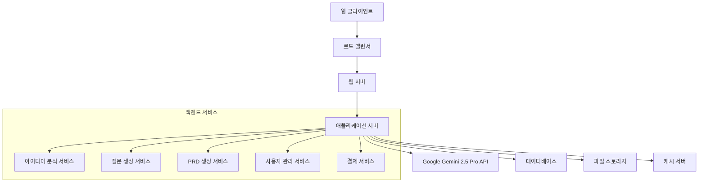

# 설계 문서

## 개요

PRD 제너레이터는 사용자의 한 줄 아이디어를 체계적인 역질문을 통해 구체화하고, Google Gemini 2.5 Pro API를 활용하여 실제 개발 가능한 PRD를 생성하는 웹 기반 SaaS 서비스입니다. 사용자 친화적인 인터페이스와 효율적인 LLM 활용을 통해 비기술적 배경의 사용자도 쉽게 서비스 기획을 완성할 수 있도록 설계되었습니다.

## 아키텍처

### 전체 시스템 아키텍처



### 기술 스택

**프론트엔드:**
- React.js 또는 Next.js (SEO 최적화)
- TypeScript
- Tailwind CSS (빠른 UI 개발)
- React Query (상태 관리)

**백엔드:**
- Node.js + Express.js 또는 Python + FastAPI
- TypeScript/Python
- JWT 인증
- Google Gemini 2.5 Pro API SDK

**데이터베이스:**
- PostgreSQL (메인 데이터)
- Redis (캐싱 및 세션)

**인프라:**
- Vercel/Netlify (프론트엔드 배포)
- Railway/Render (백엔드 배포)
- AWS S3 (파일 저장)

## 컴포넌트 및 인터페이스

### 페이지 구조 및 세부 내용

#### 1. 메인 페이지 (/)
**목적:** 서비스 소개 및 사용자 유입
**주요 구성요소:**
- 히어로 섹션: "한 줄 아이디어를 실제 서비스로" 메시지
- 서비스 작동 방식 3단계 설명 (아이디어 입력 → 질문 답변 → PRD 생성)
- 실제 사용 예시 (비행기표 예약 서비스 → 완성된 PRD 미리보기)
- 가격 정보 및 무료 체험 버튼
- 성공 사례 및 사용자 후기

#### 2. 아이디어 입력 페이지 (/create)
**목적:** 초기 아이디어 수집 및 프로젝트 시작
**주요 구성요소:**
- 대형 텍스트 입력 필드 (플레이스홀더: "예: 비행기표 예약 서비스")
- 아이디어 예시 버튼들 (클릭 시 자동 입력)
- 진행 과정 안내 (예상 소요시간: 10-15분)
- 프로젝트명 입력 필드 (선택사항)

#### 3. 질문-답변 페이지 (/interview/:projectId)
**목적:** 체계적인 역질문을 통한 아이디어 구체화
**주요 구성요소:**
- 진행률 표시 바 (현재 질문 / 전체 예상 질문)
- 질문 카드 (한 번에 하나씩 표시)
- 답변 입력 영역 (텍스트/선택형/체크박스 등 다양한 형태)
- 이전 질문으로 돌아가기 버튼
- 임시 저장 기능
- 실시간 아이디어 요약 사이드바

#### 4. PRD 결과 페이지 (/result/:projectId)
**목적:** 생성된 PRD 확인 및 관리
**주요 구성요소:**
- PRD 미리보기 (섹션별 탭 구조)
- 다운로드 옵션 (PDF, Word, Markdown)
- 공유 기능 (링크 생성, 이메일 전송)
- 수정 요청 기능 (추가 질문을 통한 PRD 개선)
- 개발 로드맵 시각화
- 예상 개발 비용 및 기간 정보

#### 5. 프로젝트 완료 페이지 (/complete/:projectId)
**목적:** 프로젝트 완료 축하 및 다음 단계 안내
**주요 구성요소:**
- 완료 축하 메시지
- 생성된 PRD 요약
- 다음 단계 가이드 (개발자 찾기, 개발 도구 추천 등)
- 새 프로젝트 시작 버튼
- 피드백 수집 폼

#### 6-12. 마이페이지 구조 (/my/*)

**6. 내 정보 (/my/profile)**
- 기본 정보 수정
- 프로필 이미지 업로드
- 알림 설정

**7. 내 프로젝트 (/my/projects)**
- 프로젝트 목록 (진행중/완료/임시저장)
- 각 프로젝트별 상태 및 마지막 수정일
- 프로젝트 삭제/복제 기능
- 검색 및 필터링

**8. 결제 정보 (/my/billing)**
- 현재 플랜 정보
- 사용량 통계 (생성한 PRD 수, API 사용량)
- 결제 내역
- 플랜 변경

**9. 약관 (/my/terms)**
- 서비스 이용약관
- 개인정보 처리방침
- API 사용 정책

**10. 문의하기 (/my/support)**
- FAQ 섹션
- 문의 티켓 생성
- 이전 문의 내역
- 실시간 채팅 지원

**11. 설정 (/my/settings)**
- 계정 설정
- 알림 설정
- 언어 설정
- 계정 삭제

**12-13. 인증 페이지**
- 로그인 (/login): 이메일/소셜 로그인
- 회원가입 (/signup): 이메일 인증 포함

### 핵심 서비스 컴포넌트

#### 아이디어 분석 서비스
```typescript
interface IdeaAnalysisService {
  analyzeIdea(idea: string): Promise<IdeaAnalysis>
  categorizeIdea(idea: string): Promise<ServiceCategory>
  assessFeasibility(idea: string): Promise<FeasibilityScore>
}
```

#### 질문 생성 서비스
```typescript
interface QuestionGenerationService {
  generateInitialQuestions(analysis: IdeaAnalysis): Promise<Question[]>
  generateFollowUpQuestion(context: InterviewContext): Promise<Question>
  determineCompleteness(context: InterviewContext): Promise<boolean>
}
```

#### PRD 생성 서비스
```typescript
interface PRDGenerationService {
  generatePRD(context: InterviewContext): Promise<PRDDocument>
  enhancePRD(prd: PRDDocument, feedback: string): Promise<PRDDocument>
  exportPRD(prd: PRDDocument, format: ExportFormat): Promise<Buffer>
}
```

## 데이터 모델

### 사용자 (User)
```sql
CREATE TABLE users (
  id UUID PRIMARY KEY,
  email VARCHAR(255) UNIQUE NOT NULL,
  password_hash VARCHAR(255),
  name VARCHAR(100),
  avatar_url VARCHAR(500),
  plan_type VARCHAR(50) DEFAULT 'free',
  created_at TIMESTAMP DEFAULT NOW(),
  updated_at TIMESTAMP DEFAULT NOW()
);
```

### 프로젝트 (Project)
```sql
CREATE TABLE projects (
  id UUID PRIMARY KEY,
  user_id UUID REFERENCES users(id),
  name VARCHAR(200),
  initial_idea TEXT NOT NULL,
  status VARCHAR(50) DEFAULT 'draft', -- draft, interviewing, completed
  created_at TIMESTAMP DEFAULT NOW(),
  updated_at TIMESTAMP DEFAULT NOW()
);
```

### 인터뷰 세션 (Interview Session)
```sql
CREATE TABLE interview_sessions (
  id UUID PRIMARY KEY,
  project_id UUID REFERENCES projects(id),
  questions JSONB,
  answers JSONB,
  current_step INTEGER DEFAULT 0,
  completed_at TIMESTAMP,
  created_at TIMESTAMP DEFAULT NOW()
);
```

### PRD 문서 (PRD Document)
```sql
CREATE TABLE prd_documents (
  id UUID PRIMARY KEY,
  project_id UUID REFERENCES projects(id),
  content JSONB NOT NULL,
  version INTEGER DEFAULT 1,
  generated_at TIMESTAMP DEFAULT NOW()
);
```

## 프롬프트 설계

### 아이디어 분석 프롬프트
```
당신은 서비스 기획 전문가입니다. 사용자가 입력한 아이디어를 분석하여 다음 정보를 제공해주세요:

사용자 아이디어: "{user_idea}"

분석 결과를 다음 JSON 형식으로 제공해주세요:
{
  "category": "서비스 카테고리 (예: 예약/결제, 소셜, 커머스 등)",
  "target_users": "예상 타겟 사용자",
  "core_value": "핵심 가치 제안",
  "complexity_level": "구현 복잡도 (1-5)",
  "similar_services": ["유사 서비스 예시들"],
  "key_questions": ["구체화를 위해 필요한 핵심 질문들"]
}
```

### 질문 생성 프롬프트
```
당신은 서비스 기획을 위한 인터뷰어입니다. 다음 컨텍스트를 바탕으로 사용자에게 할 다음 질문을 생성해주세요.

아이디어: "{initial_idea}"
이전 질문들과 답변: {previous_qa}
현재 단계: {current_step}

다음 질문은 다음 조건을 만족해야 합니다:
1. 이전 답변을 바탕으로 더 구체적인 정보를 얻을 수 있어야 함
2. 실제 서비스 개발에 필요한 정보를 수집해야 함
3. 사용자가 이해하기 쉬운 언어로 작성되어야 함
4. 선택형 또는 서술형 중 적절한 형태를 선택해야 함

JSON 형식으로 응답해주세요:
{
  "question": "질문 내용",
  "type": "text|select|checkbox",
  "options": ["선택형인 경우 옵션들"],
  "explanation": "왜 이 질문이 필요한지 설명"
}
```

### PRD 생성 프롬프트
```
당신은 PRD(Product Requirements Document) 작성 전문가입니다. 다음 정보를 바탕으로 실제 개발에 활용할 수 있는 상세한 PRD를 작성해주세요.

초기 아이디어: "{initial_idea}"
인터뷰 결과: {interview_results}

PRD는 다음 섹션을 포함해야 합니다:
1. 프로젝트 개요
2. 타겟 사용자 및 페르소나
3. 핵심 기능 명세
4. 사용자 플로우
5. 기술 요구사항
6. 개발 우선순위
7. 예상 개발 일정
8. 성공 지표

각 섹션은 실제 개발팀이 바로 활용할 수 있을 만큼 구체적이어야 합니다.
```

## 오류 처리

### API 오류 처리 전략
- Google Gemini API 호출 실패 시 재시도 로직 (최대 3회)
- Rate Limit 초과 시 대기 후 재시도
- API 응답 파싱 오류 시 기본값 제공
- 사용자에게 친화적인 오류 메시지 표시

### 사용자 경험 오류 처리
- 네트워크 연결 오류 시 오프라인 모드 안내
- 세션 만료 시 자동 저장 및 복구
- 브라우저 호환성 문제 시 대안 제시

## 테스트 전략

### 단위 테스트
- 각 서비스 컴포넌트별 독립적인 테스트
- 프롬프트 생성 로직 테스트
- 데이터 모델 검증 테스트

### 통합 테스트
- Google Gemini API 연동 테스트
- 전체 사용자 플로우 테스트
- 데이터베이스 연동 테스트

### E2E 테스트
- 실제 사용자 시나리오 기반 테스트
- 다양한 브라우저 환경 테스트
- 모바일 반응형 테스트

### 성능 테스트
- API 응답 시간 측정
- 동시 사용자 부하 테스트
- 메모리 사용량 모니터링

## 보안 고려사항

### 데이터 보안
- 사용자 아이디어 및 PRD 암호화 저장
- API 키 환경변수 관리
- HTTPS 강제 적용

### 인증 및 권한
- JWT 토큰 기반 인증
- 세션 타임아웃 설정
- 사용자별 데이터 접근 제어

### API 보안
- Rate Limiting 적용
- CORS 정책 설정
- SQL Injection 방지

## 확장성 고려사항

### 수평적 확장
- 마이크로서비스 아키텍처 준비
- 로드 밸런서 구성
- 데이터베이스 샤딩 계획

### 기능 확장
- 다국어 지원 준비
- 추가 LLM 모델 연동 가능성
- 협업 기능 확장 계획